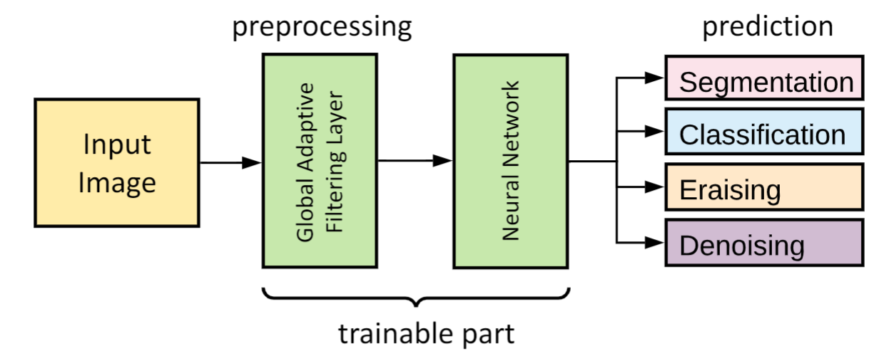

[](https://python.org)
[](https://pytorch.org/)

# Intelligent Frequency-space Image Filtering for Computer Vision Problems in Medicine

This repository is dedicated to the implementation of the idea of a **Global Adaptive Filtering Layer**



## Installation Requirements

The file [`environment.yml`](environment.yml) contains the necessary libraries to run all scripts

It is necessary:

1. create conda environment and install all packages through the command: `conda env create -f environment.yml`
2. activate environment to run scripts from it: `conda activate ultrasound`

## Usage Example

To use a layer with your model, just do the following:

```python
from models.adaptive_layer import AdaptiveLayer, GeneralAdaptiveLayer


class Model(torch.nn.Module):
    def __init__(self, ..., n_channels=1, image_size=(512, 512), adaptive_layer_type=None):
        super(UNet, self).__init__()

        self.name = 'Model'
        if adaptive_layer_type is not None:
            self.name = '_'.join([self.name, 'adaptive', adaptive_layer_type])

        self.adaptive_layer_type = adaptive_layer_type
        if self.adaptive_layer_type in ('spectrum', 'spectrum_log', 'phase'):
            self.adaptive_layer = AdaptiveLayer((n_channels, ) + image_size,
                                                adjustment=self.adaptive_layer_type)
        elif self.adaptive_layer_type == 'general_spectrum':
            self.adaptive_layer = GeneralAdaptiveLayer((n_channels, ) + image_size,
                                                       adjustment=self.adaptive_layer_type,
                                                       activation_function_name='relu')
        
        # your Model class init

    def forward(self, x):
        if self.adaptive_layer_type is not None:
            x = self.adaptive_layer(x)

        # your Model class forward method
```

## Datasets. How to Download and Structure

**`!Attention!`** The name of the folder with the dataset must be one of the following: **`Endocrinology`**, **`BUSI`**, **`BPUI`**

* **Endocrinology** Dataset
  
  This dataset provided by [the Center for Endocrinology](https://www.endocrincentr.ru/) and is not in the public domain (there is no way to download it).

* [Breast Ultrasound Images Dataset (Dataset **BUSI**) (253 MB)](https://scholar.cu.edu.eg/?q=afahmy/pages/dataset)

  ```
  Al-Dhabyani W, Gomaa M, Khaled H, Fahmy A. Dataset of breast ultrasound images.
  Data in Brief. 2020 Feb;28:104863. DOI: 10.1016/j.dib.2019.104863.
  ```
  
  The archive should be unpacked and turned into the following structure:

  ```
  ├───BUSI
      ├───benign
          ├───benign (1).png
          ├───benign (1)_mask.png
          └─── ...
      ├───malignant
          ├───malignant (1).png
          ├───malignant (1)_mask.png
          └─── ...
      ├───normal
          ├───normal (1).png
          ├───normal (1)_mask.png
          └─── ...
  ```

* [Brachial Plexus Ultrasound Images (**BPUI**) train (1.08 GB)](https://www.kaggle.com/c/ultrasound-nerve-segmentation/data)

  The archive should be unpacked and turned into the following structure:

    ```
    ├───BPUI
        ├───1_1.tif
        ├───1_1_mask.tif
        └─── ...
    ```

## How to Train Models

To train a model, you should 

1. initially choose a CV task:
    * Segmentation
    * Classification
    * Denoising/Erasing

2. correct [`configs.yaml`](configs.yaml) file

   **`!Attention!`** Do not forget to specify **path to folder with train data**.
   
   **`!Attention!`** For classification task use `number of classes = 3` for **BUSI** dataset and `number of classes = 6` for **Endocrinology** dataset.

3. for denoising/erasing task comment/uncomment lines in file `train_denoising.py` with appropriate noise overlaying transform

4. run appropriate script `.py`:

```
python ./train_<CV task>.py
```

or with parameters
  * --device &emsp; &emsp; &emsp; # cuda device id number (default 0)
  * --random_seed &nbsp; # random seed (default 1)
  * --nolog &emsp; &emsp; &emsp; # turn off logging

## Train Process Performance

As a result, you will receive 

* the saved best model `.pth` next to files with code
* a log file `.tfevents` of the training process in folder where the results of experiments from the tensorboard will be recorded (see [`configs.yaml`](configs.yaml) file)

## Inference Examples

### Segmentation Results on **Endocrinology** Dataset

From left to right: ultrasound slice, ground truth mask, segmentation result performed by base model and with _spectrum_, _spectrum log_ and _phase_ adjustments.


From left to right: ultrasound slice, ground truth mask, segmentation result performed by base model and with _general spectrum_ adjustment.


### Erasing Results on **BUSI** Dataset

From left to right: ultrasound slice, corrupted image, restored image by base model and with _spectrum_, _spectrum log_ and _phase_ adjustments.


## Citation

If you use this package in your publications or other work, please cite it as follows:

```
@article{shipitsin2021global,
         author={Shipitsin, Viktor and Bespalov, Iaroslav and Dylov, Dmitry V},
         year={2021},
         month=Mar,
         title={Global Adaptive Filtering Layer for Computer Vision},
         journal={arXiv preprint arXiv:2010.01177v3},
}
```

## Contacts

Viktor Shipitsin - `shipitsin@phystech.edu`
